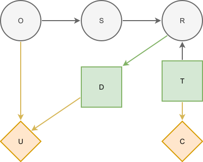

# The Oil Wildcatter Problem
## Description
The goal of this optimization problem is to help the oil wildcatter decide whether to run a geological test, such as a seismic survey, for a potential oil well before deciding whether or not to drill it.

The only way to confirm the presence of petroleum in the subsurface is through drilling, but the likelihood of its occurrence can be estimated beforehand based on the geological structure. This likelihood is commonly expressed as the Probability of geological Success (PoS) - the chance of making a discovery of oil or gas in a sufficient quantity and with the flowability needed for continuous production. A seismic survey is a cost-effective, non-invasive method to support the estimation of PoS. It uses acoustic waves to map rock formations without physical intervention. Then, depending on the type of geological structures identified, the survey can suggest higher or lower chances of finding oil or gas. Besides that, the geological structures that usually store these fluids need to be closed so that they can effectively trap the hydrocarbons inside them (Milkov, 2015).

Based on this introduction, let's understand the original wildcatter problem proposed by Raiffa (1968). 

> An oil wildcatter must decide either to drill or not to drill a well. There is uncertainty related to the capacity of this well to produce oil continuously and in sufficient quantity. The possible states are dry (no oil), wet (some oil) or soaking (a large amount of oil). Each state can provide a different payoff for the wildcatter, while drilling the well also involves a cost. In order to help him infer the underlying structure of the site, and consequently the state of the well, he can make use of a seismic survey at a specific cost. The original narrative provides the joint probability between the well states and the seismic outcomes, which can be No Structure (NS), Open Structure (OS) and Closed Structure (CS). The first one refers to no reservoir rock being found; in the second, reservoir rock is found, but the structure is not capable of trapping oil; and, in the last, the structure is capable of trapping oil. The decisions to be made by the wildcatter are whether to run the seismic survey and, depending on its result, whether to drill the well.

## Influence diagram




*Figure 1. Influence diagram for the wildcatter problem (adapted from [4]).*

The representation of the problem is shown above. The chance node $O$ represents the state of the hydrocarbon occurrence at the site, with $O = \{\text{dry, wet, soaking}\}$. The chance node $S$ represents the true geological condition of the site, considering both the presence of a suitable structure and its capacity to trap hydrocarbons, with $S=\{\text{ No Structure (NS), Open Structure (OS) and Closed Structure (CS)}\}$.


Since the geological condition $S$ is not directly observed, the seismic survey can support the inference about this geological structure. The decision whether to run it is represented by the decision node $T = \{\text{test, no test}\}$. If performed, the survey will in turn produce a report as its result. The states of the chance node $R$ refer to the possible results of this report and follow the same qualitative states used for the geological structure, including an additional state (N/A) for when the survey is not performed $R = \{\text{N/A, NS, OS, CS}\}$.

The wildcatter drilling decision is represented by the decision node $D = \{\text{Drill, Not Drill}\}$.  

The value nodes in the model are 
- $C$: representing the cost of running the seismic survey.
- $U$: represents the net value of drilling the well, accounting for the drilling cost. The revenue depends on the state of the site.
# Initialise influence diagram

We start defining the Decision Programming model by initialising the influence diagram.

```julia
diagram = InfluenceDiagram()
```

The states of the nodes are defined in advance as constants to ease the following node creation process.

```julia
const O_states = ["dry", "wet", "soaking"]
const S_states = ["NS", "OS", "CS"]
const T_states = ["test", "no test"]
const D_states = ["drill", "no drill"]
const R_states = ["N/A","NS", "OS", "CS"]
```

 We then add the nodes. The chance and decision nodes are identified by their names. When declaring the nodes, they are also given information sets and states. In Decision Programming, we add the chance and decision nodes in the follwoing way. The node creation order must respect the information sets: all nodes in ($I_j$) must be added before node $j$. For example, $O$, $S$ and $T$ must be created before $R$.
 
 ```julia
add_node!(diagram, ChanceNode("O", [], O_states))
add_node!(diagram, DecisionNode("T", [], T_states))
add_node!(diagram, ChanceNode("S", ["O"], S_states))
add_node!(diagram, ChanceNode("R", ["S","T"], R_states))
add_node!(diagram, DecisionNode("D", ["R"], D_states))
```

The value nodes are added in a similar fashion. However, value nodes do not have states because they map their information states to utility values instead.

```julia
add_node!(diagram, ValueNode("U", ["D", "O"]))
add_node!(diagram, ValueNode("C", ["T"]))
```

### Generate arcs
Now that all of the nodes have been added to the influence diagram we generate the arcs between the nodes. This step automatically orders the nodes, gives them indices and reorganises the information into the appropriate form.
```julia
generate_arcs!(diagram)
```

### Probability Distributions of the Chance Nodes
After generating the arcs, we can now define the probability distributions for the chance nodes.

First of all, we define the probability distribution for the oil node $O$. In the practice, it can be provided based 
on prior geological knowledge or historical data.

$$ℙ(O = \text{soaking}) = 0.2, \quad ℙ(O = \text{wet}) = 0.3, \quad ℙ(O = \text{dry}) = 0.5.$$


```julia
X_O = ProbabilityMatrix(diagram, "O")
X_O["dry"] = 0.5
X_O["wet"] = 0.3
X_O["soaking"] = 0.2
add_probabilities!(diagram,"O",X_O)
```

Initially, the uncertainty associated with the relationship between the geological structure and the actual state of hydrocarbon occurrence at the site is considered. Therefore, the probability distribution of the node $S$ is defined conditionally on each 
possible state of the oil node $O$.

The table below shows the aforementioned conditional probability distribution.

| State of $O$ | $S = NS$ | $S = OS$ | $S = CS$ |
|:-------------|---------:|---------:|---------:|
| Dry          | 0.95     | 0.04     | 0.01     |
| Wet          | 0.05     | 0.90     | 0.05     |
| Soaking      | 0.01     | 0.04     | 0.95     |

In Decision Programming, the probability matrix of node $S$ can be added using the `ProbabilityMatrix` function and the `add_probabilities!` function as shown below.

```julia
X_S = ProbabilityMatrix(diagram, "S")

# The rows correspond to the states of the oil node O (dry, wet, soaking),
# while the columns correspond to the states of the geological structure node S (NS, OS, CS).
X_S["dry", :]    = [0.95, 0.04, 0.01]
X_S["wet", :] = [0.05, 0.90, 0.05]
X_S["soaking", :]    = [0.01, 0.04, 0.95]

add_probabilities!(diagram, "S", X_S)
```

This distribution, given by $\mathbb{P}(R \mid S,T)$, is conditional on both the geological structure node $S$ and the decision node $T$, which represents whether the seismic survey is performed. It describes the informative capability of the seismic survey by expressing the probability of obtaining each possible report state $R$ given the actual geological structure $S$ and the decision $T$.


```julia
X_R = ProbabilityMatrix(diagram, "R")
# Test performed - R_states = ["N/A", "NS", "OS", "CS"]
X_R["NS", "test", :] = [0.0, 0.80, 0.15, 0.05]
X_R["OS", "test", :] = [0.0, 0.20, 0.60, 0.20]
X_R["CS", "test", :] = [0.0, 0.05, 0.20, 0.75]

# Test not performed, the report is always "N/A"
X_R["NS", "no test", :] = [1.0, 0.0, 0.0, 0.0]
X_R["OS", "no test", :] = [1.0, 0.0, 0.0, 0.0]
X_R["CS", "no test", :] = [1.0, 0.0, 0.0, 0.0]
add_probabilities!(diagram,"R",X_R)
```

### Utilities 

The Utilities are created through utility matrices and added to the model using the `UtilityMatrix` function and the `add_utilities!` function, as illustrated in the example below.

We have two utility nodes in this example: one for the seismic survey costs and one for net value obtained from drilling decisions and the
payoffs related to the different states of the hydrocarbon ocurrence.


```julia
# Payoff for different states of the hydrocarbon occurrence
payoff = Dict(
    "dry" => 0,
    "wet" => 1_000_000,
    "soaking" => 5_000_000
)

# Cost for performing the seismic survey
cost_T = -5_000

# Cost for drilling
cost_D  = -800000

Y_U = UtilityMatrix(diagram, "U")
for o in O_states
    Y_U["drill", o] = cost_D + payoff[o]
    Y_U["no drill", o] = 0
end
add_utilities!(diagram, "U", Y_U)

Y_C = UtilityMatrix(diagram, "C")
Y_C["test"] = cost_T
Y_C["no test"] = 0
add_utilities!(diagram, "C", Y_C)

```

## Generating the model


Next we generate the decision model. 
```julia
@info("Creating the decision model.")
model, z, x_s = generate_model(
    diagram,
    model_type="DP",
    probability_cut=true
)
```

## Solving the model
We set up the solver for the problem and optimise it.

```julia
@info("Starting the optimization process.")
optimizer = optimizer_with_attributes(
    () -> HiGHS.Optimizer()
)
set_optimizer(model, optimizer)

optimize!(model)
```

## Analyzing results
We extract the results in the following way.
```julia
@info("Extracting results.")
Z = DecisionStrategy(diagram,z)
S_probabilities = StateProbabilities(diagram, Z)
U_distribution = UtilityDistribution(diagram, Z)
```

### Decision strategy
The decision strategy shows the optimal decisions for each decision node given the states of their parent nodes. In this example, it indicated 
that the optimal decision is to perform the seismic survey (T) and then decide whether to drill (D) based on the report (R) from the survey.
If the report (R) indicates "NS" (No Structure), the optimal decision is not to drill. If the report indicates "OS" (Open Structure) or "CS" (Closed Structure), the optimal decision is to drill.


```julia
julia> print_decision_strategy(diagram, Z, S_probabilities)
┌───────────────┐
│ Decision in T │
├───────────────┤
│ test          │
└───────────────┘
┌───────────────┬───────────────┐
│ State(s) of R │ Decision in D │
├───────────────┼───────────────┤
│ NS            │ no drill      │
│ OS            │ drill         │
│ CS            │ drill         │
└───────────────┴───────────────┘
```


### Utility distribution

We can also print the utility distribution for the optimal strategy and some basic statistics for the distribution.

```julia
julia> print_utility_distribution(U_distribution)

┌────────────────┬─────────────┐
│        Utility │ Probability │
│        Float64 │     Float64 │
├────────────────┼─────────────┤
│ -805000.000000 │    0.115750 │
│   -5000.000000 │    0.463700 │
│  195000.000000 │    0.233250 │
│ 4195000.000000 │    0.187300 │
└────────────────┴─────────────┘
```

```julia
julia> print_statistics(U_distribution)
┌──────────┬────────────────┐
│     Name │     Statistics │
│   String │        Float64 │
├──────────┼────────────────┤
│     Mean │  735710.000000 │
│      Std │ 1684853.315841 │
│ Skewness │       1.485489 │
│ Kurtosis │       0.429148 │
└──────────┴────────────────┘
```


## References

[^1]: Raiffa, H. (1968). Decision analysis: Introductory lectures on choices under uncertainty.

[^2]: Milkov, A. V. (2015). Risk tables for less biased and more consistent estimation of probability of geological success (PoS) for segments with conventional oil and gas prospective resources. Earth-Science Reviews, 150, 453-476.

[^3]: Bielza, C., Gómez, M., & Shenoy, P. P. (2011). A review of representation issues and modeling challenges with influence diagrams. Omega, 39(3), 227-241.

[^4]: Terho, T., Oliveira, F., Salo, A., & Munari, P. (2026). An efficient mixed-integer linear programming formulation for solving influence diagrams. arXiv preprint arXiv:2601.08460.
